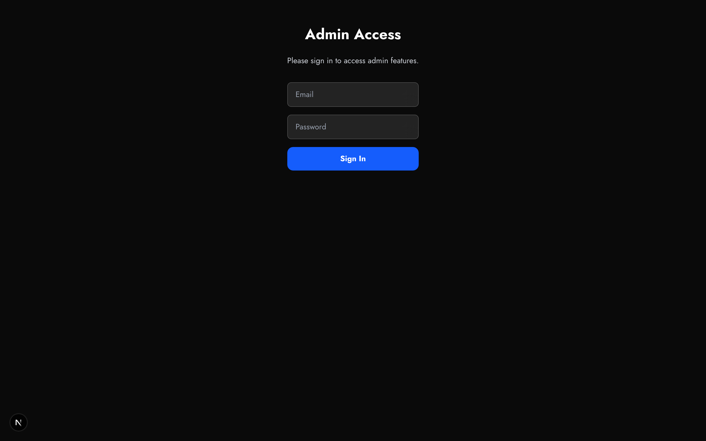

# Admin Requirements



## Authentication

- Email/password login at `/admin/login`
- bcrypt password hashing
- JWT sessions (30-day expiry)
- Protected routes via middleware

## User Management

CLI: `npm run manage-users`

- Create, update, list, delete admin users

## Dashboard `/admin`

- Quick stats (events, votes, photos)
- Recent activity
- Quick actions

## Event Management `/admin/events`

- List all events with status
- Activate/finalize actions
- QR code generation

## Setlist Management `/admin/events/[id]/setlists`

- Band selector/tabs
- Add/edit/delete songs
- Drag to reorder
- Song type badges
- Video links

See [songs.md](./songs.md) for data model.

## Video Management `/admin/videos`

- List all videos
- Add by YouTube URL (auto-fetch metadata)
- Edit associations and metadata
- Delete with confirmation

## Social Accounts `/admin/social`

- Connect LinkedIn, Facebook, Instagram
- View connected accounts
- Post to platforms
- AI caption suggestions

## CLI Tools

```bash
npm run create-event <json>
npm run activate-event <id>
npm run finalize-event <id>
npm run manage-users
npm run bulk-upload-photos <dir> <event-id>
npm run setup-db
npm run backup-db
```
