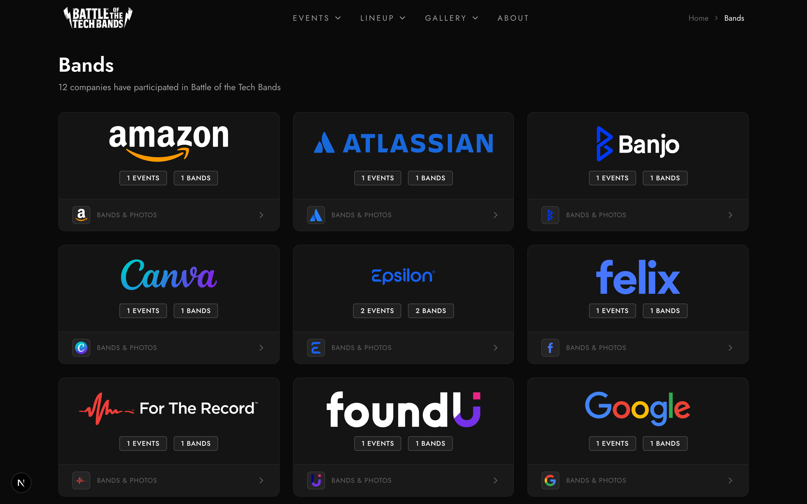

# Bands & Companies Requirements

## Company Data

- slug (primary key), name
- logo_url, icon_url
- website
- band_count, event_count (computed)

## Band Data

- id, event_id, name, description
- company_slug, order
- hero_thumbnail_url, hero_focal_point
- info (JSONB): logo_url, website, social_media, genre, members

## Companies Page `/companies`

- Company cards with logo/icon
- Company name
- Band count, event count
- Link to filtered bands

## Company Badge Component

- Variants: default (icon + name), inline, pill
- Used throughout app for band affiliation

## Band Page `/band/[bandId]`

### Hero Section

- Band hero image
- Band name, company badge
- Event association, breadcrumbs

### Score Section (Finalized)

- Score bars per category
- Total score and rank
- Vote counts

### Setlist Section

- Songs in performance order
- Type badges, video links

### Band Info

- Description, genre, members

## Event Page Band List

- Performance order number
- Band name (link to detail)
- Description
- Company badge

## Results Page Band Display

- Rank with winner indicator
- Band name, company badge
- Total score
- Link to band detail

## Hero Image Selection

1. Photo with `band_hero` label for this band
2. Any photo of this band
3. Event hero
4. Gradient placeholder
