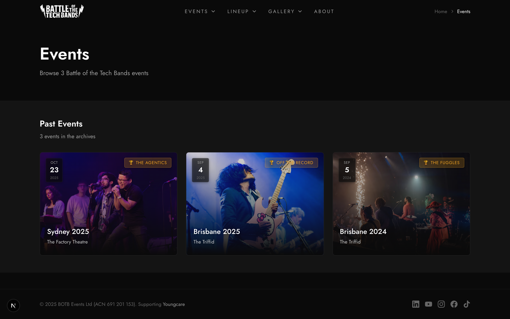

# Events Requirements

## Event States

| State     | Description                             |
| --------- | --------------------------------------- |
| Upcoming  | Created, not yet active, bands editable |
| Voting    | Active, accepting votes                 |
| Finalized | Complete, results frozen                |

## Event Display Sections

Events are grouped into **Upcoming** and **Past** sections across the app:

### Upcoming Events

- **Statuses shown**: `upcoming`, `voting`
- **Sort order**: By date ascending (soonest first)
- **Display**: Event cards with date badge, location, band count
- **Home page**: Featured section with "View All Events" link
- **Events page**: Tab/section for upcoming

### Past Events

- **Statuses shown**: `finalized` only
- **Sort order**: By date descending (most recent first)
- **Display**: Event cards with winner info, trophy icon
- **Home page**: "Past Events" section with results highlights
- **Events page**: Tab/section for past events
- **Results page**: Lists all finalized events

### Active Event (Special Case)

- When an event's status is `voting`, `closed` or `locked` — from voting
  opening until the results are released
- Shows live indicator banner on home page
- "Vote Now" CTA while `voting`; "results coming soon" once voting has closed
- Never listed as a past event and never shown with a winner while live
- Only one event should be active at a time

## Event Data

- id, name, date, location, timezone
- status: upcoming/voting/closed/locked/finalized (see [run-the-night.md](./run-the-night.md#event-statuses))
- is_active: boolean (legacy; kept in step with the status)
- is_test: boolean — the rehearsal event, hidden from every public listing
- info (JSONB): image_url, description, ticket_url, social_media

## Event Creation

JSON format in `events/` directory:

- Event name, date, location, timezone
- Bands array with name, company_slug, order

CLI: `pnpm create-event events/sydney-2025.json`

## CLI Commands

| Command                    | Description      |
| -------------------------- | ---------------- |
| `pnpm create-event <json>` | Create from JSON |
| `pnpm list-events`         | List all events  |
| `pnpm activate-event <id>` | Enable voting    |
| `pnpm finalize-event <id>` | Freeze results   |
| `pnpm cleanup-event <id>`  | Clear event data |

## Event Page Requirements

### Hero Section

- Event name, date badge, location
- Status badge
- Hero image from labeled photos

### Band List

- All competing bands with order
- Company badges
- Links to band detail pages

### Actions by Status

| Status    | Actions                      |
| --------- | ---------------------------- |
| Upcoming  | Get Tickets, Add to Calendar |
| Voting    | Vote Now, View Scores        |
| Finalized | View Results, See Photos     |
