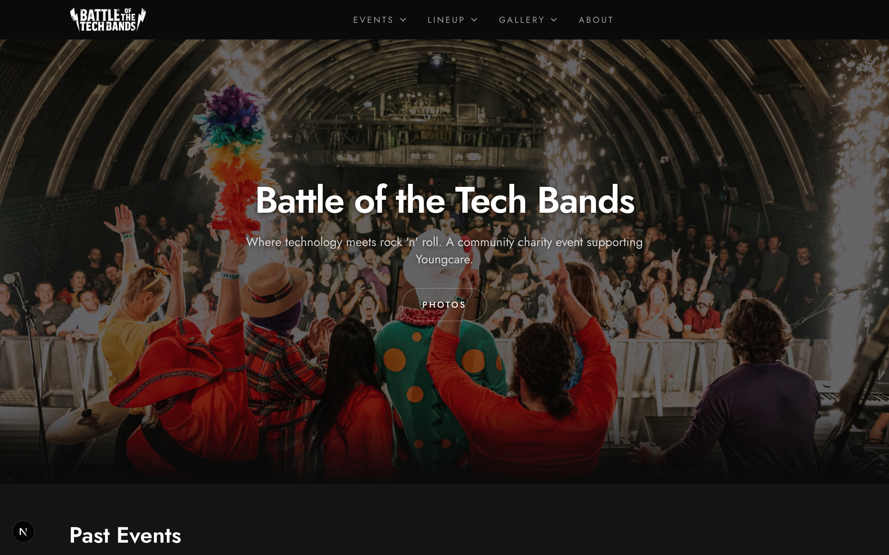

# Home Page Requirements

_Mobile view:_

## Page Structure

1. Hero (full viewport)
2. Upcoming Events
3. Video Strip
4. Past Events
5. Company Logos
6. Footer

## Hero Section

- Full viewport height
- Background image from `global_hero` labeled photos
- Dark overlay for text
- Main headline and tagline
- CTAs: "View Events" / "Vote Now" (if active event)

## Upcoming Events Section

- Event cards (Tomorrowland style)
- Date badge, location, band count
- "View All Events" link
- Empty state: "No upcoming events" with register CTA

## Video Strip

- Horizontal scrolling carousel
- YouTube thumbnails with play overlay
- Subscribe CTA
- Click → modal player

## Past Events Section

- Event cards with winner info
- Trophy icon, winner band name
- "View Results" links

## Company Logos

- Marquee/carousel of logos
- Continuous scroll animation

## Active Event Banner (Optional)

- When event is in "voting" status
- Live indicator, event name, "Vote Now" link

## Loading States

- Skeleton loading for each section
- Section-level error boundaries

## Performance

- Hero loads immediately (LCP < 2.5s)
- Lazy load below-fold content
