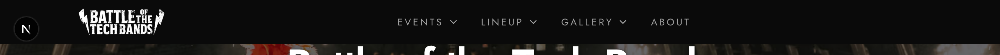

# Navigation Requirements

## Header

### Desktop (≥1024px)

- Logo (links to home)
- Dropdown menus: Events, Experience, Lineup
- Account button

### Mobile (<1024px)

- Logo
- Hamburger menu → drawer with all items

### Variants

- `transparent`: Home page hero
- `glass`: Scrolled/content pages
- `solid`: Admin pages

### Scroll Behavior

- Transparent → glass on scroll (home page)
- Fixed position

## Dropdown Menus

**Events**: All Events, Upcoming, Past, Results

**Experience**: Photos, Videos, Songs, About

**Lineup**: Bands, Companies, Photographers

## Mobile Menu

- Full-height slide-out drawer
- Nested accordion for dropdowns
- Close: button, click outside, Escape
- Body scroll lock when open

## Footer

### Simple Variant

- Copyright
- Social icons (YouTube, Instagram, LinkedIn)
- Privacy/Terms links

### Full Variant

- Multi-column link sections
- Newsletter signup (future)
- Social icons

## Breadcrumbs

- Chevron separators
- Links for all but last item
- Examples: Home > Events > Sydney 2025 > Results

## Admin Navigation

### Sidebar

- Dashboard, Events, Videos, Social
- Active state highlight
- Logout button

### Topbar

- Current page title
- User info
