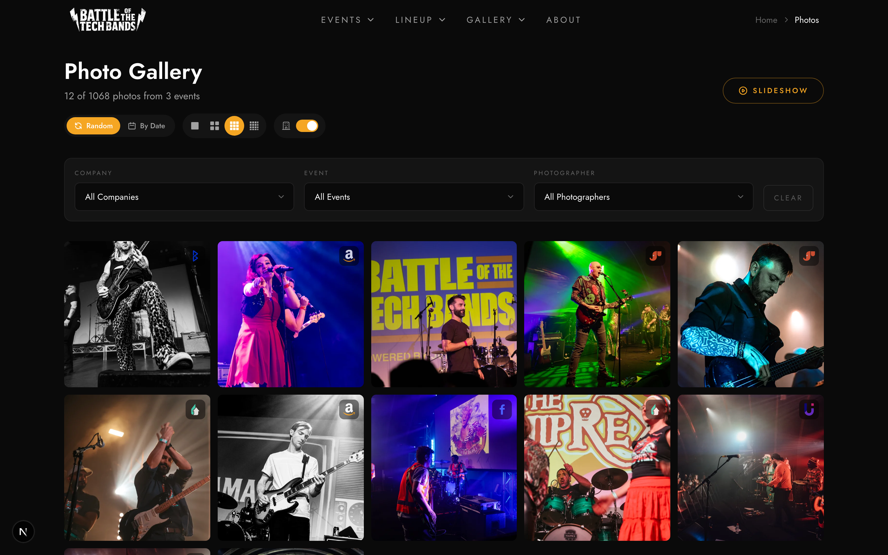

# Photo Requirements

## Upload

- Formats: JPEG, PNG, WebP
- Extract EXIF metadata
- Match photographer from XMP
- Generate thumbnail (300x300) and large (2000px) variants

## Photo Metadata

- event_id, band_id, photographer_slug
- blob_url, thumbnail_url, large_url
- labels: band_hero, event_hero, global_hero, featured
- focal_point for hero crops

## Gallery

### Photo Grid

- Responsive 2/3/4 columns
- Thumbnails with lazy loading
- Click to open slideshow

### Filtering

- Filter by event, band, photographer, company
- URL state for shareable filters
- Active filter pills with clear all

## Slideshow

### Navigation

- Previous/Next buttons
- Keyboard arrows
- Swipe on mobile
- Thumbnail strip (desktop)

### Display

- Single photo centered
- Full-screen capability
- Photo metadata overlay
- Photographer credit

### Actions

- Download original
- Copy photo link
- Share to social
- Close with Escape

### Admin Actions

- Delete photo
- Set hero labels
- Crop thumbnail
- Set focal point

## Performance

- Lazy load images
- Prefetch adjacent photos
- Skeleton loading states
