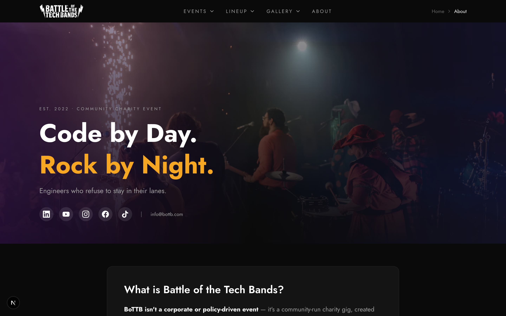

# Public Pages Requirements

## Static Pages

### About `/about`

- Mission and history
- Charity information
- Team/organizers

### FAQ `/faq`

- Accordion questions
- FAQPage structured data

### Privacy `/privacy`

- Privacy policy

### Terms `/terms`

- Terms of service

## Photographers

### List `/photographers`

- Photographer cards with avatar
- Name, bio, photo count
- Social/website links

### Detail `/photographer/[slug]`

- Photographer info
- Photo gallery filtered to photographer

## Events List `/events`

- All events with status badges
- Filter tabs: All, Upcoming, Past
- Event cards with date badges

## SEO Requirements

Every page needs:

- Unique title (<60 chars)
- Description (<160 chars)
- OpenGraph tags
- Twitter card tags

### Structured Data

| Page  | Schema       |
| ----- | ------------ |
| Event | Event        |
| Band  | MusicGroup   |
| FAQ   | FAQPage      |
| About | Organization |

## Performance

- LCP < 2.5s
- CLS < 0.1
- Lighthouse > 90

## Accessibility

- WCAG 2.1 AA
- Keyboard navigation
- Color contrast 4.5:1
- Touch targets 44px min

## Mobile

- Mobile-first approach
- Touch-friendly targets
- Optimized for event venue WiFi
