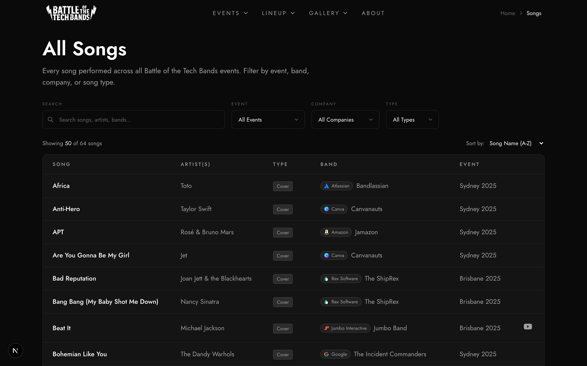

# Songs Requirements

## Song Data

- song_title, artist
- song_type: cover, mashup, medley, transition
- position (order in setlist)
- secondary_artist/secondary_song (for mashups/transitions)
- video_url (YouTube)

## Song Types

| Type       | Display                  | Example               |
| ---------- | ------------------------ | --------------------- |
| Cover      | Song • Artist            | "Africa" • Toto       |
| Mashup     | Song 1 / Song 2          | "Titanium / Stronger" |
| Medley     | Song 1 / Song 2 / Song 3 | "80s Medley"          |
| Transition | Song 1 → Song 2          | "Rain → Umbrella"     |

## All Songs Page `/songs`

### Filter Bar

- Search input (title, artist)
- Event, band, type filters
- Clear filters button

### Data Table

- Song title (with video link if available)
- Artist
- Song type badge
- Band name (link)
- Event name (link)
- Sortable columns

## Setlist Display (Band Page)

- Numbered position indicators
- Song title formatted by type
- Artist(s)
- Type badge
- Video link button

## Admin Setlist Editor

- Band selector/tabs
- Song list with drag handles
- Drag to reorder
- Edit modal: title, artist, type, secondary fields, video URL
- Delete with confirmation
- Add new song button
