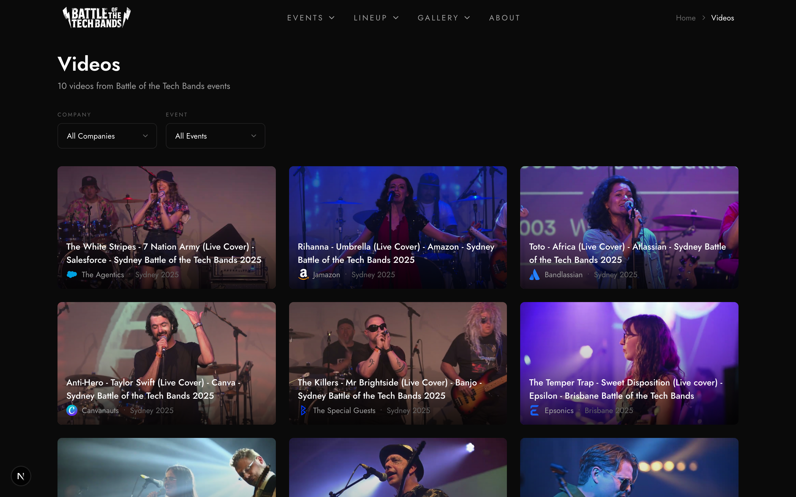

# Videos Requirements

## Video Data

- YouTube video ID
- Title, description
- Event and band associations
- Thumbnail URL

## Video Display

### Video Carousel/Strip

- YouTube thumbnails with play overlay
- Video title
- Scroll arrows (desktop), swipe (mobile)
- Click to open modal player

### Video Modal

- YouTube embed iframe
- Close button, Escape key, click outside

### Subscribe CTA

- YouTube channel subscribe button
- Track clicks via analytics

## Page Locations

| Page      | Content                            |
| --------- | ---------------------------------- |
| Home      | Featured videos from recent events |
| Event     | Videos specific to event           |
| Band      | Videos featuring the band          |
| `/videos` | All videos with filters            |

## Admin Management

- Table of all videos with thumbnails
- Add by YouTube URL (auto-fetch metadata)
- Select event/band associations
- Edit title/description
- Delete with confirmation

## Analytics Events

- `video:clicked`: Thumbnail clicked
- `youtube:subscribe_clicked`: Subscribe button clicked
