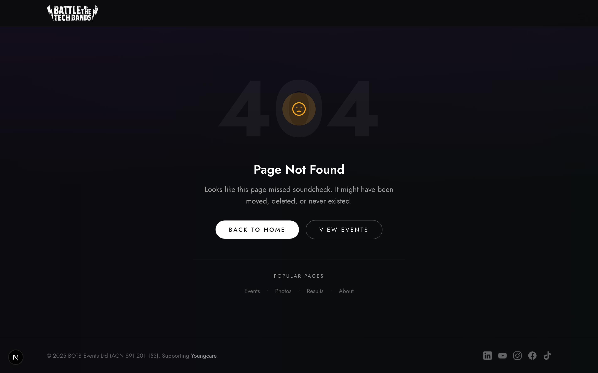

# Voting Requirements

## Voting Types

| Type  | Path                    | Input           | Points            |
| ----- | ----------------------- | --------------- | ----------------- |
| Crowd | `/vote/crowd/[eventId]` | Select one band | 20 (proportional) |
| Judge | `/vote/judge/[eventId]` | Score all bands | 80 (averaged)     |

## Scoring Criteria

| Criteria    | Points  |
| ----------- | ------- |
| Song Choice | 20      |
| Performance | 30      |
| Crowd Vibe  | 30      |
| Crowd Vote  | 20      |
| **Total**   | **100** |

## UI States

### Crowd Voting Page

The page follows the event's status by itself (it polls a cached ballot
endpoint), so a phone left open switches screens without a refresh.

1. **Voting Opens Soon**: event is `upcoming`
2. **New Voter**: Band list with radio buttons, "Submit Vote"
3. **Returning Voter** (cookie): Previous choice shown, "Update Vote"
4. **Success**: "Vote Submitted!", or "Vote Received" when the vote is held for review
5. **Voting Has Closed**: event is `closed` or `locked`; links to results once `finalized`
6. **Could not send**: a notice with the form still usable (busy server is retried automatically)

### Judge Voting Page

- Band accordion/cards
- Slider/input per criterion
- Validation: all bands, all criteria, valid ranges
- "Submit All Scores" button

## Double Voting Prevention

A vote that looks like a repeat is **held for review, not refused** — identical
phones cannot be told apart. Only approved votes count. See
[run-the-night.md](./run-the-night.md#held-votes).

1. **Cookie**: Remembers the voter's own vote so they can change it
2. **Email**: Same address as an earlier vote → held
3. **FingerprintJS**: Same browser fingerprint as an earlier vote → held
4. **Custom Fingerprint**: Identical browser on the same IP address → held

## API

- `POST /api/votes`: Submit a crowd vote (public; 200 counted, 201 held for review)
- `POST /api/votes/batch`: Admin: one judge's whole sheet, validated and saved atomically
- `GET /api/events/[eventId]/ballot`: Public: voting open? and the bands
